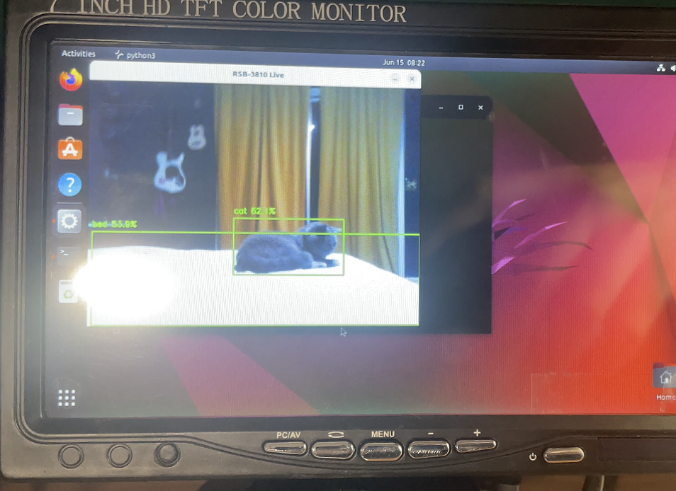

# RSB‑3810 Ubuntu Quick‑Start & Edge‑AI Demo


---

## Overview

In this guide we'll walk through flashing Ubuntu 22.04 to the Advantech [RSB‑3810](https://ess-wiki.advantech.com.tw/view/RSB-3810), installing the MediaTek genio‑tools SDK, and running a real‑time TensorFlow Lite object‑detection demo. By the end you'll have a fan‑less edge computer recognising objects from a USB webcam—ready for industrial IoT or smart‑vision prototypes.

## Prerequisites

- [RSB‑3810 board](https://ess-wiki.advantech.com.tw/view/RSB-3810)
- 12V DC power adapter
- USB‑A to USB‑A cable (for flashing)
- USB-to-RS232 serial adapter + included DB9 cable (female-female)
- Ubuntu 22.04 system (native or VM with USB passthrough enabled)
- [Genio tools installation guide](https://mediatek.gitlab.io/aiot/doc/aiot-dev-guide/master/sw/yocto/get-started/env-setup/flash-env-linux.html)

---

## Flashing the Board (USB Fastboot)

### 1. Install Genio Tools

Follow the [official genio-tools instructions](https://mediatek.gitlab.io/aiot/doc/aiot-dev-guide/master/sw/yocto/get-started/env-setup/flash-env-linux.html) and ensure the USB rules and permissions are correctly set.

```bash
sudo apt update
pipx install genio-tools
# or: pip3 install genio-tools --break-system-packages
```


Add udev rules:

```bash
echo 'SUBSYSTEM=="usb", ATTR{idVendor}=="0e8d", ATTR{idProduct}=="201c", MODE="0660", TAG+="uaccess"
SUBSYSTEM=="usb", ATTR{idVendor}=="0e8d", ATTR{idProduct}=="0003", MODE="0660", TAG+="uaccess"
SUBSYSTEM=="usb", ATTR{idVendor}=="0403", MODE="0660", TAG+="uaccess"
SUBSYSTEM=="gpio", MODE="0660", TAG+="uaccess"' | sudo tee /etc/udev/rules.d/72-aiot.rules
sudo udevadm control --reload-rules && sudo udevadm trigger
sudo usermod -a -G plugdev $USER
```


Log out and back in.

### 2. Get the OS Image

Download the latest image from the [RSB‑3810 Wiki](https://advantecho365-my.sharepoint.com/:u:/g/personal/jems_cheng_advantech_com/EZkFOqGDCL9MgE_PAdHvhIIBgjPQU9bqtHtFUM1i_WF-vA?e=IQGq1ds) — Ubuntu 22.04 eMMC image.

```bash
tar -xvzf Ubuntu_Recovery_Image.tgz -C ~/ 
cd ~/rsb3810_ubuntu
```


### 3. Flash Procedure

1. Connect the USB-A ↔ USB-A cable to the board and your Ubuntu machine
    
2. Power on the board (12V DC)
    
    
3. In terminal, run:

```bash
genio-flash
```


4. On the board, **hold the Download button**, **press Reset**, then **release Download** when < wait for any device > appears onscreen. 
    
    
5. When you see `Waiting for any device`, wait ~8–10s for the flashing to begin

Full flash takes several minutes. Wait for completion confirmation.


---

## Debug Console (UART Serial Access)

### Connection Setup

Use the included DB9 cable with the USB-to-RS232 adapter. The correct DB9 connector is the one with **3 physical pins visible**.

1. Connect DB9 to the RS232 port on the board (labeled COM1)
    
2. Plug adapter into your host machine
3. Use `screen` or `minicom` at `921600` baud:

```bash
screen /dev/ttyUSB0 921600
```

> You may need to hit `Enter` a few times if output is garbled at first.

### Tip for VM Users

Ensure USB passthrough is enabled for the RS232 adapter in VirtualBox or VMware. Add a device filter manually if needed.

For USB flashing in a VM: make sure the Mediatek device is passed through to the VM before running `genio-flash`. It may only appear briefly when booting to flash mode.

---

## Run the TensorFlow Lite AI Demo

### 1. Network Access

If your RSB‑3810 doesn't include Wi‑Fi, plug in Ethernet. Internet is required to install dependencies.


### 2. Log In

Use UART console or attach monitor + keyboard. Default login credentials:

```bash
Username: ubuntu
Password: ubuntu
```

> If prompted to change the password but it fails with `Authentication token manipulation error`, log in without sudo and use:

```bash
passwd
```

Then re-login to continue.

### 3. Set Up Demo Environment

Install video and capture dependencies to support most USB webcams:

```bash
sudo apt install v4l-utils libv4l-dev libjpeg-dev libgstreamer1.0-dev                  gstreamer1.0-plugins-base gstreamer1.0-plugins-good                  gstreamer1.0-plugins-bad gstreamer1.0-plugins-ugly                  gstreamer1.0-libav ffmpeg
```

Then install Python dependencies:

```bash
sudo apt update
sudo apt install python3-pip python3-opencv -y
pip3 install numpy==1.24.4 tflite-runtime
```

#### Alternative: Automated Install

As a convenience, an `install.sh` script is provided to automate the setup steps. After logging into the board, you can run it directly:

```bash
./install.sh
```
This will install all necessary packages and download the AI model files.

### 4. Get Demo Script

Use a compatible MobileNet SSD model directly from TensorFlow:

```bash
wget https://storage.googleapis.com/download.tensorflow.org/models/tflite/coco_ssd_mobilenet_v1_1.0_quant_2018_06_29.zip
unzip coco_ssd_mobilenet_v1_1.0_quant_2018_06_29.zip
mv detect.tflite model.tflite
mv labelmap.txt labels.txt
```


`labelmap.txt` already starts with "???" (the background class), so no edits are required.

Then fetch or create the demo script:

```bash
nano demo.py
```

```python
import cv2
import numpy as np
import sys
import tflite_runtime.interpreter as tflite

with open('labels.txt', 'r') as f:
    labels = [line.strip() for line in f if line.strip()]

if labels and labels[0].startswith('???'):
    labels[0] = 'background'

interpreter = tflite.Interpreter(model_path="model.tflite")
interpreter.allocate_tensors()

input_details = interpreter.get_input_details()
output_details = interpreter.get_output_details()
height = input_details[0]['shape'][1]
width = input_details[0]['shape'][2]

video_device = sys.argv[1] if len(sys.argv) > 1 else '/dev/video0'
cap = cv2.VideoCapture(video_device)

while True:
    ret, frame = cap.read()
    if not ret:
        print("Failed to grab frame")
        break

    input_data = cv2.resize(frame, (width, height))
    input_data = np.expand_dims(input_data, axis=0)
    input_data = np.uint8(input_data)

    interpreter.set_tensor(input_details[0]['index'], input_data)
    interpreter.invoke()

    boxes = interpreter.get_tensor(output_details[0]['index'])[0]
    classes = interpreter.get_tensor(output_details[1]['index'])[0]
    scores = interpreter.get_tensor(output_details[2]['index'])[0]

    for i in range(len(scores)):
        if scores[i] > 0.5:
            cid = int(classes[i]) + 1
            label = labels[cid] if cid < len(labels) else f"Unknown ({cid})"
            print(f"Detected ID {cid}: {label} at {scores[i]*100:.1f}% confidence")

    if hasattr(cv2, 'imshow'):
        for i in range(len(scores)):
            if scores[i] > 0.5:
                ymin, xmin, ymax, xmax = boxes[i]
                (left, top, right, bottom) = (int(xmin * frame.shape[1]), int(ymin * frame.shape[0]),
                                              int(xmax * frame.shape[1]), int(ymax * frame.shape[0]))
                cid = int(classes[i]) + 1
                label = labels[cid] if cid < len(labels) else f"Unknown ({cid})"
                cv2.rectangle(frame, (left, top), (right, bottom), (0, 255, 0), 2)
                cv2.putText(frame, f"{label} {scores[i]*100:.1f}%", (left, top - 10),
                            cv2.FONT_HERSHEY_SIMPLEX, 0.5, (0, 255, 0), 2)

        cv2.imshow('RSB‑3810 Live', frame)
        if cv2.waitKey(1) & 0xFF == ord('q'):
            break

cap.release()
cv2.destroyAllWindows()
```

Then run the demo:

```bash
python3 demo.py
# or, specify camera device:
python3 demo.py /dev/video5
```



---

## Resources

- [RSB‑3810 ESS Wiki](https://ess-wiki.advantech.com.tw/view/AIM-Linux/RSB-3810)
- [Demo Project GitHub]()